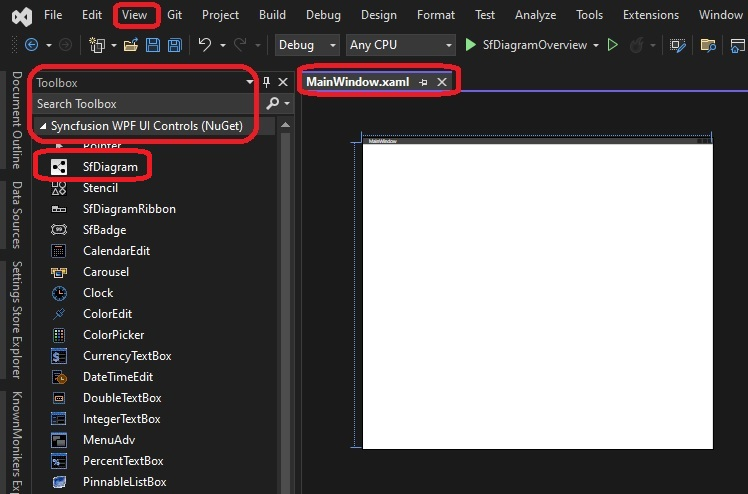
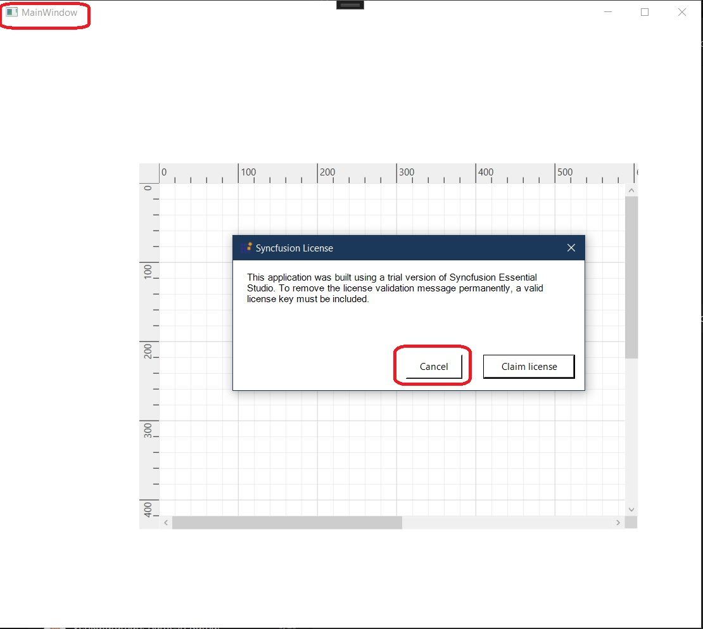

## WPF Diagram (SfDiagram) Overview 

## Ref
1. https://help.syncfusion.com/wpf/diagram/overview
2. https://help.syncfusion.com/wpf/diagram/getting-started
3. https://help.syncfusion.com/wpf/control-dependencies
4. https://help.syncfusion.com/wpf/control-dependencies#sfdiagram
5. https://www.nuget.org/packages/Syncfusion.SfDiagram.WPF/
6. https://help.syncfusion.com/wpf/visual-studio-integration/nuget-packages
7. https://help.syncfusion.com/common/essential-studio/licensing/overview
8. https://support.syncfusion.com/kb/article/7863/difference-between-the-unlock-key-and-licensing-key#licensing-key

## How this app is created.
1. This example is based on this [Syncfusion Getting Started Tut.](https://help.syncfusion.com/wpf/diagram/getting-started)

2. Create a regular wpf app targetting the latest framework(**net7.0-windows** as on date).

3. Add nuget references [as described here specifically for sf diagram.](https://help.syncfusion.com/wpf/control-dependencies#sfdiagram) 
```xml
<ItemGroup>
    <PackageReference Include="Syncfusion.SfDiagram.WPF" Version="22.2.11" />
	<PackageReference Include="Syncfusion.Shared.WPF" Version="22.2.11" />
	<PackageReference Include="Syncfusion.SfDiagramRibbon.WPF" Version="22.2.11" />
</ItemGroup>
```

4. In Visual Studio, open the MainWindow xaml file. Next ensure ToolBox window is open(Views -> Toolbox) 

5. Build the solution, reopen visual studio if required. Now you see the 


6. You can now drag and drop the SfDiagram tool on to the main window. Note the license issue message box.



7. Note in the xaml, you will see the SfDiagram xaml like the followng.

```xml
<Grid>
    <syncfusion:SfDiagram HorizontalAlignment="Left" Margin="176,176,0,0" VerticalAlignment="Top" Height="462" Width="630">
        <syncfusion:SfDiagram.Connectors>
            <syncfusion:ConnectorCollection/>
        </syncfusion:SfDiagram.Connectors>
        <syncfusion:SfDiagram.Groups>
            <syncfusion:GroupCollection/>
        </syncfusion:SfDiagram.Groups>
        <syncfusion:SfDiagram.HorizontalRuler>
            <syncfusion:Ruler/>
        </syncfusion:SfDiagram.HorizontalRuler>
        <syncfusion:SfDiagram.Nodes>
            <syncfusion:NodeCollection/>
        </syncfusion:SfDiagram.Nodes>
        <syncfusion:SfDiagram.SnapSettings>
            <syncfusion:SnapSettings SnapConstraints="ShowLines"/>
        </syncfusion:SfDiagram.SnapSettings>
        <syncfusion:SfDiagram.Theme>
            <syncfusion:OfficeTheme/>
        </syncfusion:SfDiagram.Theme>
        <syncfusion:SfDiagram.VerticalRuler>
            <syncfusion:Ruler Orientation="Vertical" />
        </syncfusion:SfDiagram.VerticalRuler>
    </syncfusion:SfDiagram>
</Grid>
```

Try removing the Horizontal Ruler and Vertical Ruler and see the changes. There are others such as snap settings, try changing them as well. 

Also note some of the properties such as Theme are license dependent. That is if you change <syncfusion:OfficeTheme/> to something else, it may not work, if you dont have a valid license.

8. 