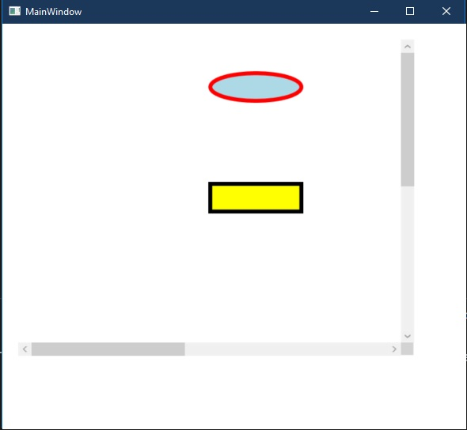

1. Reference: https://help.syncfusion.com/wpf/diagram/getting-started

2. Here we have two nodes added to the nodes collection. Then two different styles **BeginShapeStyle** and **EndShapeStyle** which is present as a static resource, is applied to the nodes.

